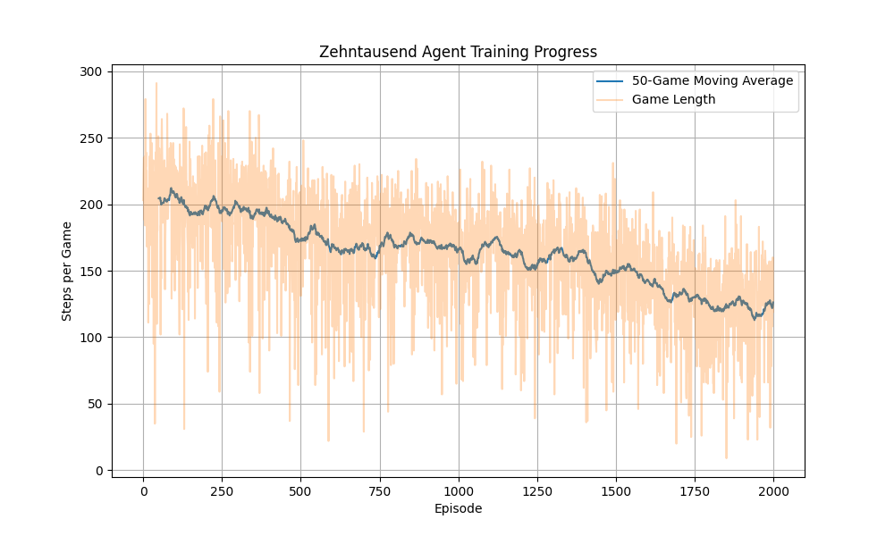

# Zehntausend RL Agent
A superhuman Reinforcement Learning agent for the dice game Zehntausend (10,000).

## Architecture
- **Environment**: Custom Python implementation of Zehntausend rules (5 dice, simple rules) wrapped in a Gym-like interface. State is represented by a 10-dimensional vector (Dice normalized, scores, turns).
- **Agent**: PPO (Proximal Policy Optimization) with an Actor-Critic network.
    - **Actor**: Policy head outputting probabilities for 64 actions (32 dice subsets * 2 decisions).
    - **Critic**: Value head predicting win probability.
    - **Backbone**: 2-layer MLP (256, 128 hidden units).
- **Training**: Self-Play. The agent plays against itself to generate data, updating parameters every ~20 episodes.

## Experimental Progress
Started with a "cheap" training run of 2000 episodes.
- **Initial Performance**: Random play resulted in long games (~200+ steps) as agents busted frequently or played inefficiently.
- **Final Performance**: After 2000 episodes, game length dropped to ~120 steps, indicating aggressive and efficient scoring.



## Usage
### Install Dependencies
Using `uv`:
```bash
uv venv .venv
source .venv/bin/activate
uv pip install torch numpy matplotlib
```

### Train
```bash
python -m src.train
```

### Plot Results
```bash
python plot_results.py
```

## Future work
Long term I want to fine-tune a small LLM to play 10.000, but for now I'm using a small specialized model I trained from scratch.  

Also I currently only support two player games.